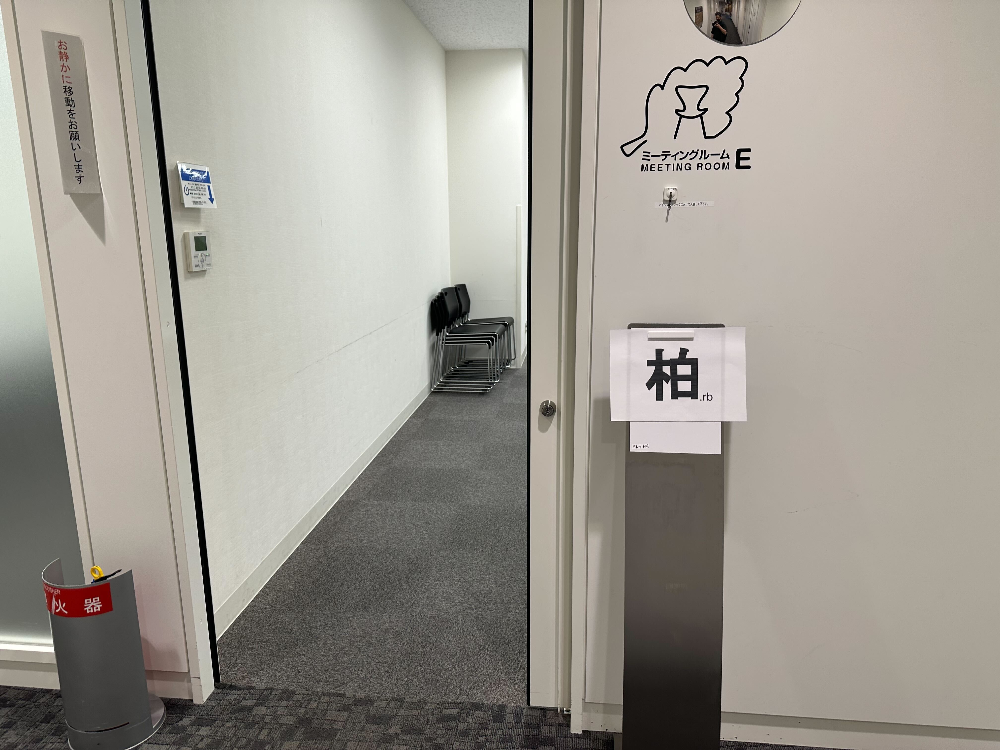
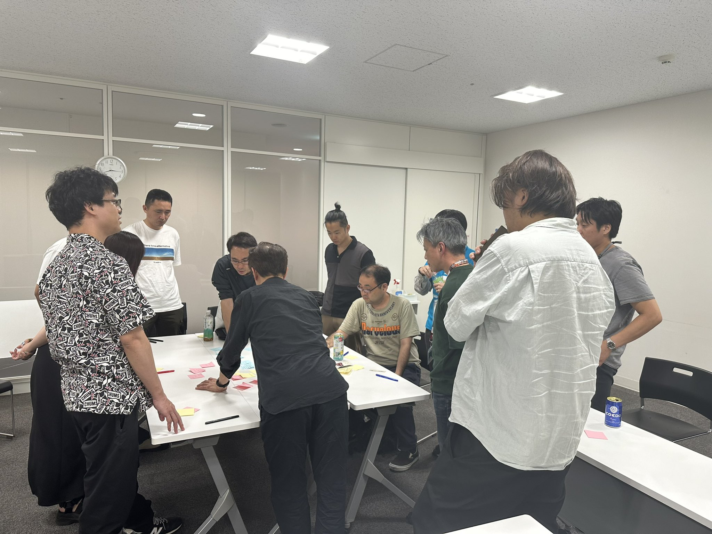
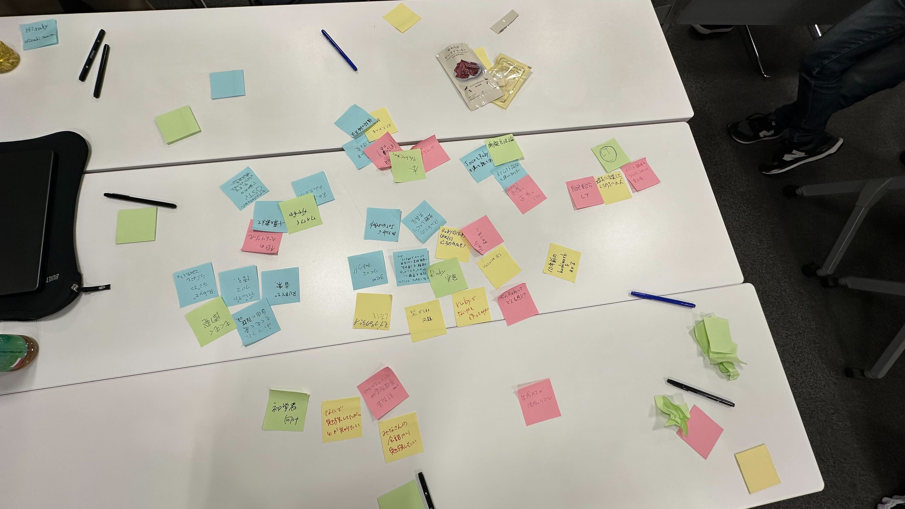

# Kashiwa.rb #0 キックオフ＆ミートアップ

## Connpass URL

https://kashiwarb.connpass.com/event/322611/

## タイムテーブル

| 時刻 | 内容 |
| --- | --- |
| 18:45 | 開場 |
| 19:00〜 | 自己紹介・アイスブレイク |
| 19:15〜 | 「こんな勉強会やっていきたい」を共有&議論するワークショップ |
| 20:00〜 | Kashiwa.rb 第1回開催に向けて |
| 20:30〜 | 撤収準備開始 |
| 21:00 | 完全撤収 |

## 当日の様子

## 成果物

- https://speakerdeck.com/kozy4324/kashiwa-dot-rb-number-0-kitukuohu-and-mitoatupu

## 会計

| 項目 | 収入 | 支出 |
| --- | --- | --- |
| 参加費 | 2,600 (200 × 13) | - |
| 会議室代 | - | 1,100 |
| プロジェクター代 | - | 550 |
| 備品代（付箋, ペン） | - | 660 |
| 合計 | 2,600 | 2,310 |
| 収支 | 290 | - |

余った290円は[手賀沼花火大会2024](https://teganuma-hanabi.kashiwa-cci.or.jp/archives/926)への募金とします。

## ２次会

龍晶餃子でおいしいビールと中華を頂きました（9名参加）
https://tabelog.com/chiba/A1203/A120301/12044920/
