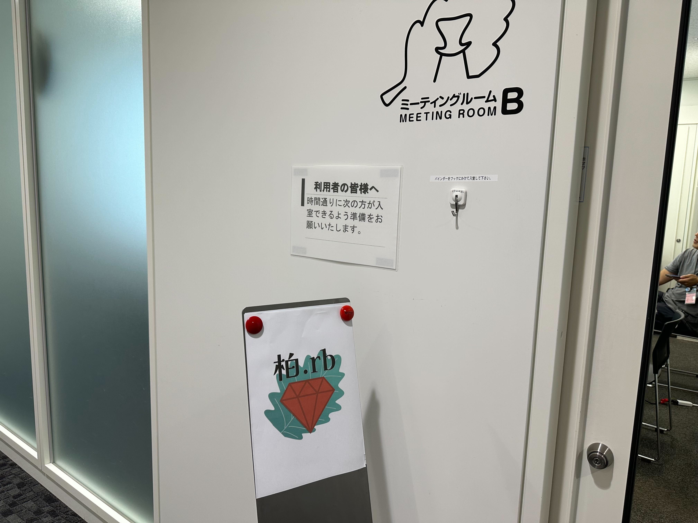
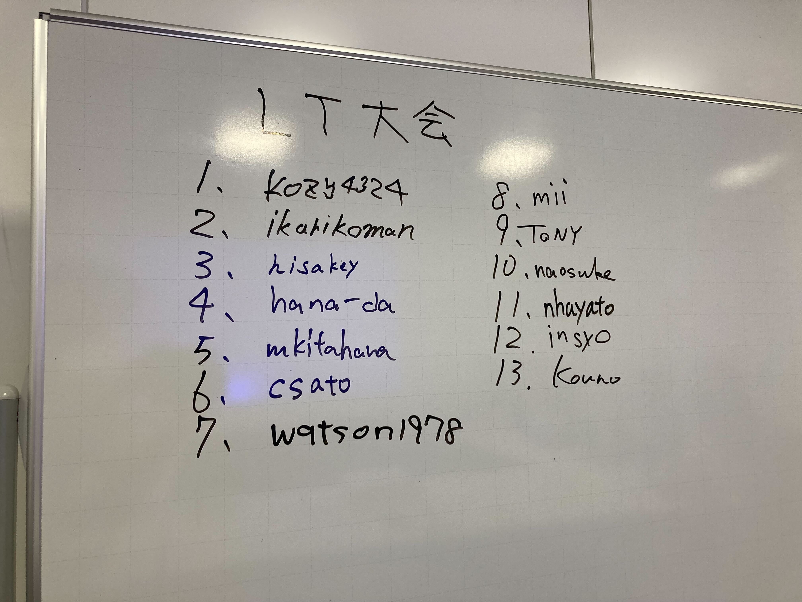
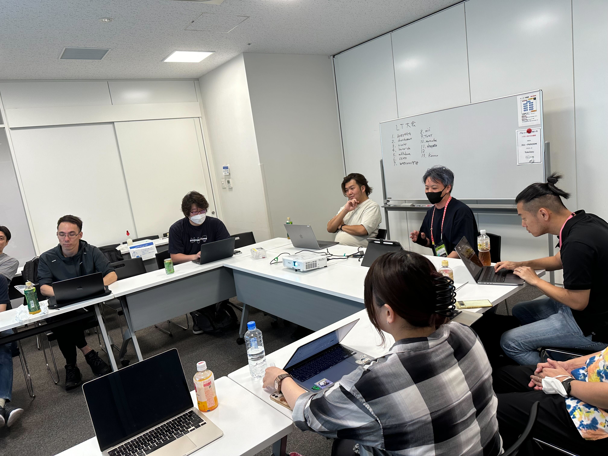

# Kashiwa.rb #1 自己紹介LT大会

## Connpass URL

https://kashiwarb.connpass.com/event/323881/

## タイムテーブル

| 時刻 | 内容 |
| --- | --- |
| 18:30 | 開場 |
| 18:45〜 | 自己紹介LTスタート |
| 20:00〜 | 懇親会 + 第2回の実施内容決めましょう |
| 20:45〜 | 撤収準備開始 |
| 21:00 | 完全撤収 |

## 当日の様子

## 発表資料

- https://kashiwarb.connpass.com/event/323881/presentation/

## 会計

| 項目 | 収入 | 支出 |
| --- | --- | --- |
| 参加費 | 1,300 (100 × 13) | - |
| 会議室代 | - | 660 |
| プロジェクター代 | - | 550 |
| 合計 | 1,300 | 1,210 |
| 収支 | 90 | - |

余った90円は[手賀沼花火大会2024](https://teganuma-hanabi.kashiwa-cci.or.jp/archives/926)への募金とします。

## ２次会

神成りでおいしいビールと焼き鳥を頂きました（10名参加）
https://www.hotpepper.jp/strJ003649083/
