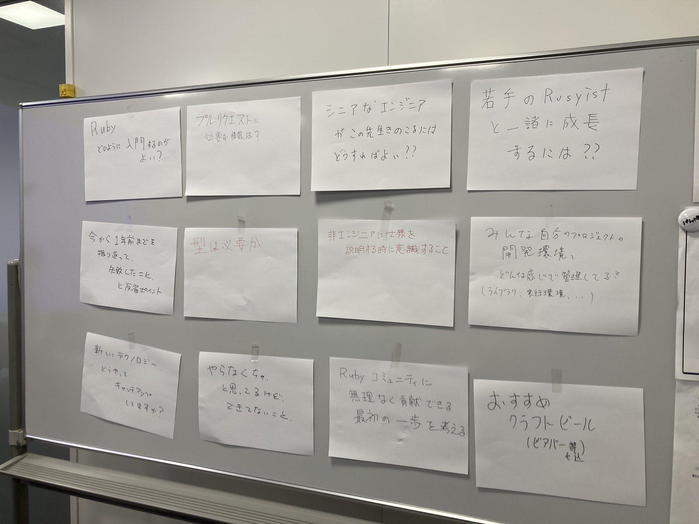
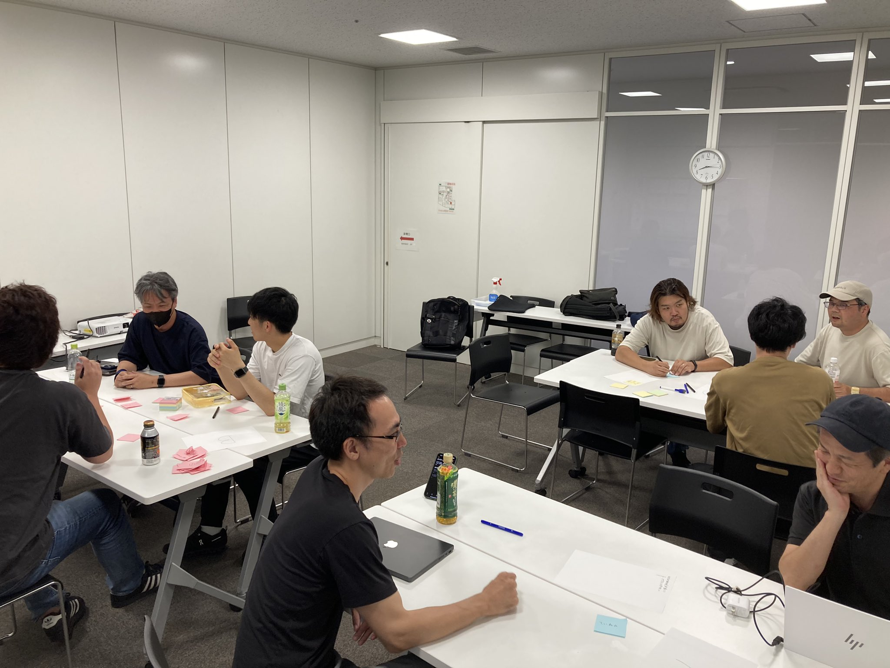
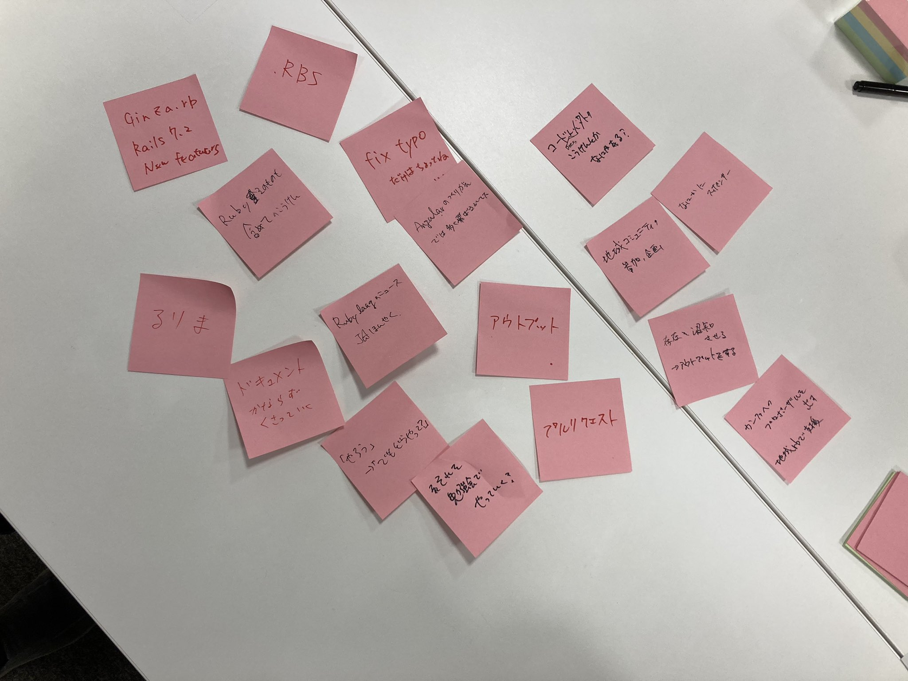

# Kashiwa.rb #2 LT&オープンスペーステクノロジー(OST)

## Connpass URL

https://kashiwarb.connpass.com/event/326495/

## タイムテーブル

| 時刻 | 内容 |
| --- | --- |
| 18:30 | 開場 |
| 18:40〜 | 運営からのお知らせ |
| 18:45〜 | LTタイム |
| 19:15〜 | オープンスペーステクノロジー |
| 20:45〜 | 撤収準備開始 |
| 21:00 | 完全撤収 |

## 当日の様子

## 発表資料

- https://kashiwarb.connpass.com/event/326495/presentation/

## Toggeter

- https://togetter.com/li/2424635

## 会計

| 項目 | 収入 | 支出 |
| --- | --- | --- |
| 参加費 | 900 (100 × 9) | - |
| 会議室代 | - | 660 |
| プロジェクター代 | - | 550 |
| 合計 | 900 | 1,210 |
| 収支 | - | 310 |

## ２次会

柏Clusterでおいしいビールを頂きました（5名参加）
https://cluster-kashiwa.com/
