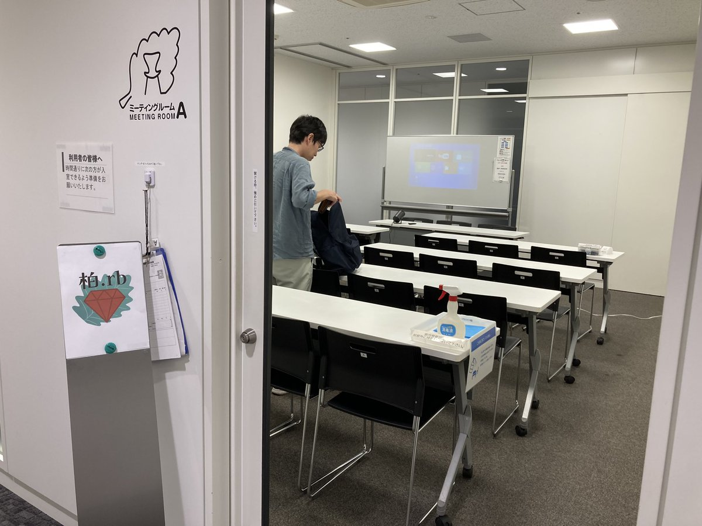
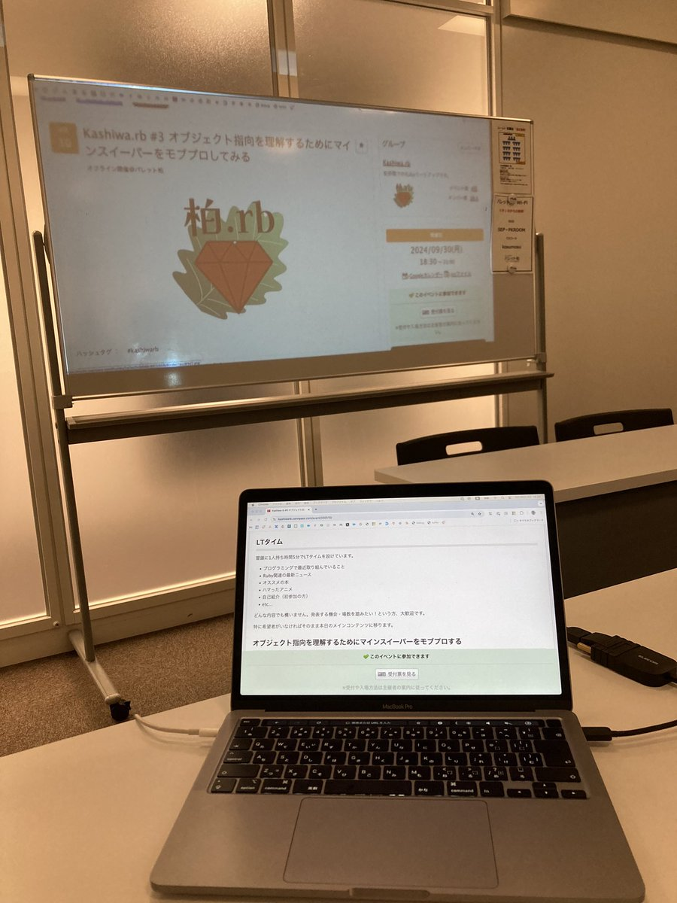
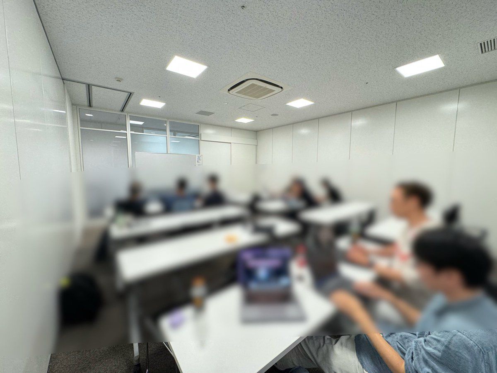
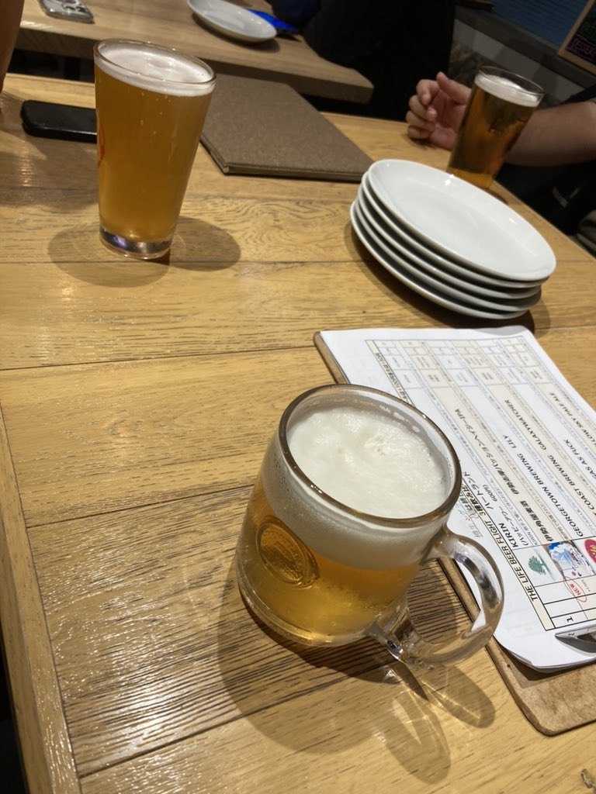

# Kashiwa.rb #3 オブジェクト指向を理解するためにマインスイーパーをモブプロしてみる

## Connpass URL

https://kashiwarb.connpass.com/event/330510/

## タイムテーブル

| 時刻 | 内容 |
| --- | --- |
| 18:30 | 開場 |
| 18:45〜 | 自己紹介 |
| 18:50〜 | LT |
| 19:05〜 | モブプロの進め方説明 |
| 19:10〜 | モブプロタイム |
| 20:10〜 | 成果物発表 |
| 20:40〜 | KPT |
| 20:50〜 | 撤収準備開始 |
| 21:00 | 会議室から完全撤収 |
| 21:00〜 | 希望者で懇親会 |

## 当日の様子

## 発表資料

- https://kashiwarb.connpass.com/event/330510/presentation/

## Toggeter

- https://togetter.com/li/2442984

## KPT

- Keep
  - 設計の議論ができて面白かった
  - これぐらい雑な感じでいい
  - 雑に書き散らかせるのがいい
  - VSCodeのLiveShare試せた
- Problem
  - プロジェクターは借りよう
  - 得意な言語で書いていい
  - VSCodeでLiveShare使おうは事前に案内できた
  - モデリングするにあたって紙を準備しておくとよかった
  - モデリングとコーディング両方は時間が足りなかった
- Try
  - またモブプロやろう、題材を求む
  - モデリングだけにフォーカスした企画でもいいかもしれない

## 会計

| 項目 | 収入 | 支出 |
| --- | --- | --- |
| 参加費 | 1000 (1000 × 10) | - |
| 会議室代 | - | 660 |
| 合計 | 1000 | 660 |
| 収支 | 340 | - |

余った金額は次回のプロジェクター代にまわします。

## ２次会

THE LIFEでおいしいビールを頂きました（8名参加）
https://the-life.gorp.jp/
