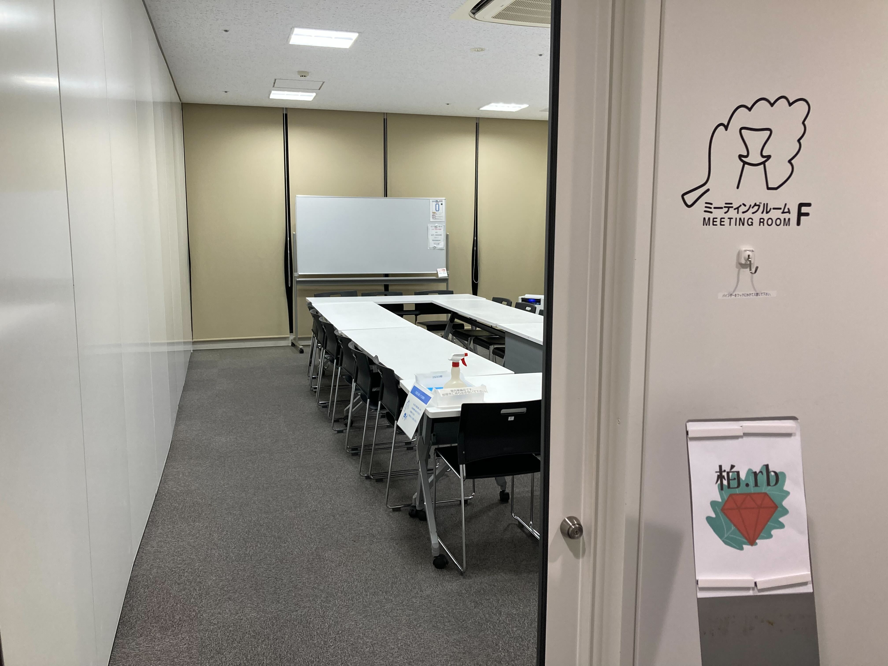
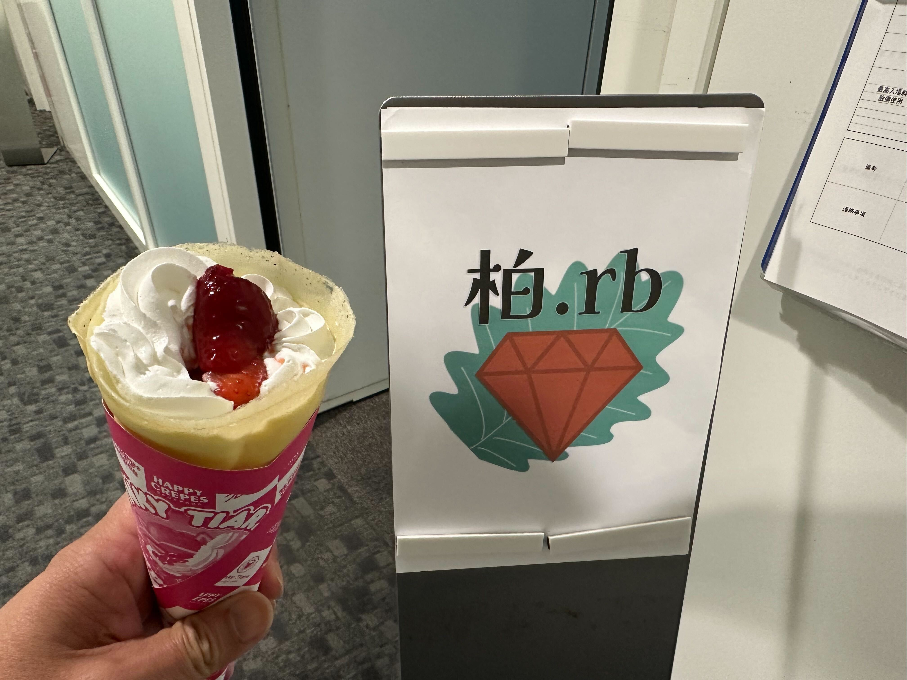

# Kashiwa.rb #4 生活発表会

## Connpass URL

https://kashiwarb.connpass.com/event/333529/

## タイムテーブル

| 時刻 | 内容 |
| --- | --- |
| 18:05頃 | 開場 |
| 18:05〜 | 雑談＆もくもくタイム |
| 19:15〜 | アイスブレイク・自己紹介 |
| 19:30〜 | 生活発表会（1人10分 × 6） |
| 20:50〜 | 撤収準備開始 |
| 21:00 | 会議室から完全撤収 |
| 21:00〜 | 希望者で懇親会 |

## 当日の様子

## 発表資料

- https://kashiwarb.connpass.com/event/333529/presentation/

## Toggeter

- https://togetter.com/li/2453786

## 会計

| 項目 | 収入 | 支出 |
| --- | --- | --- |
| 参加費 | 800 (100 × 8) | - |
| 会議室代 | - | 770 |
| プロジェクター代 | - | 550 |
| 合計 | 800 | 1320 |
| 収支 | - | 520 |

## ２次会

GLOBAR でおいしいビールを頂きました（5名参加）
https://worldbeerkitchen-glovar.owst.jp/
