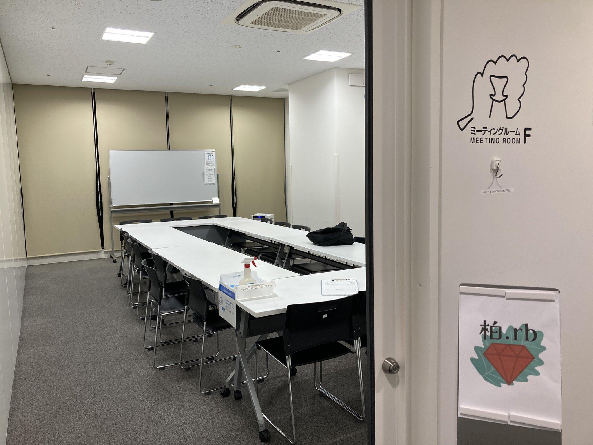
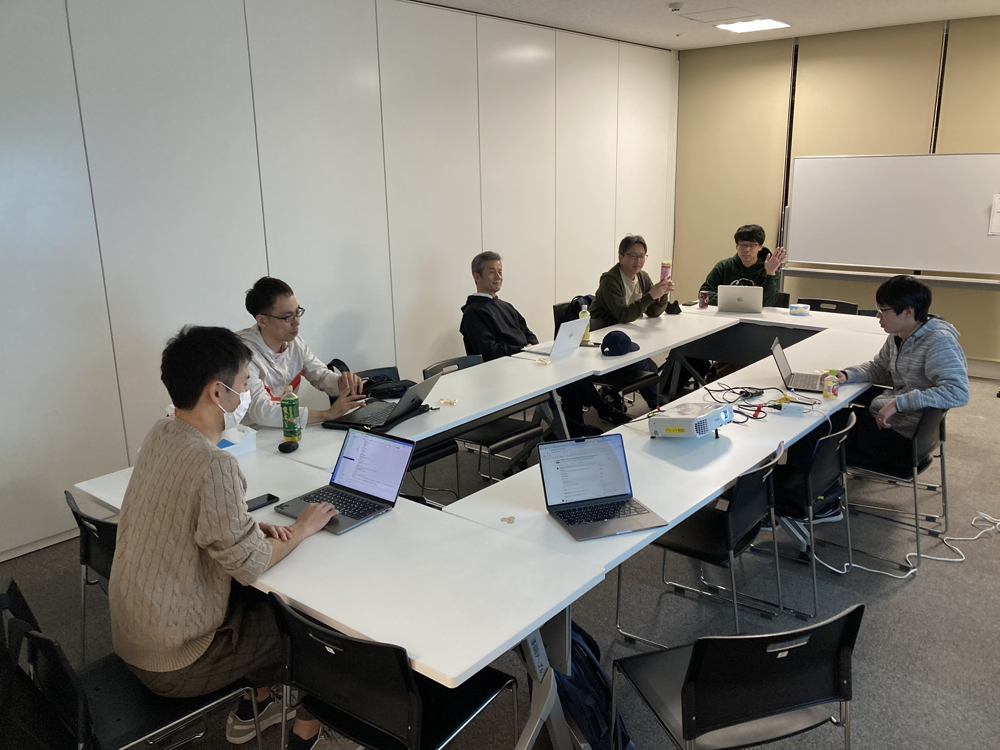
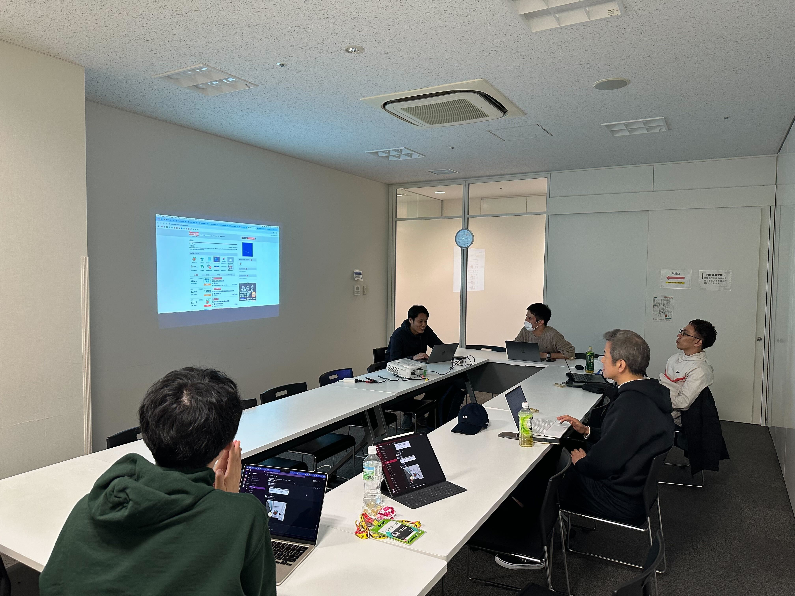
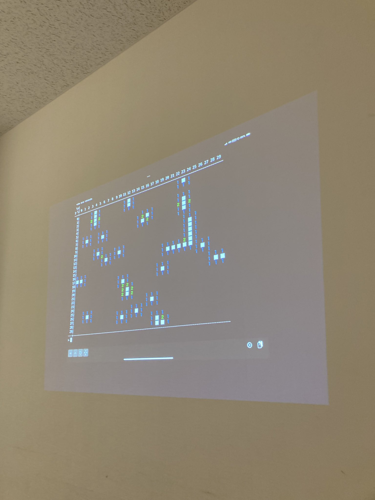

# Kashiwa.rb #5 もくもく会 & LT会

## Connpass URL

https://kashiwarb.connpass.com/event/335777/

## タイムテーブル

| 時間 | 内容 | スピーカー |
| --- | --- | --- |
| 18:05 | 開場 | - |
| 18:05〜	| 雑談＆もくもくタイム | - |
| 20:00〜	| アイスブレイク・自己紹介 | みんな |
| 20:05〜 | LTタイム | - |
| 20:05〜20:15 | LT枠1 - 自己紹介系をしたいと思っています | hogarakaryo |
| 20:15〜20:25 | LT枠2 - マインスイパーのテストを書いてみた | hana-da |
| 20:25〜20:35 | LT枠3 - 脆弱性から学ぶシリーズ CVE-2024-34341 | kozy4324 |
| 20:35〜20:45 | LT枠4 - カンファレンスでLTしました | nhayato |
| 20:45〜20:55 | LT枠5 - kaigi on rails2025に行ってきた| tonyfactory210|
| 20:55〜 | 撤収準備開始 | - |
| 21:00 | 完全撤収 | - |
| 21:00〜	| 希望者で懇親会 | - |

## 当日の様子

## 発表資料

- https://kashiwarb.connpass.com/event/335777/presentation/

## Toggeter

- https://togetter.com/li/2467684

## 会計

| 項目 | 収入 | 支出 |
| --- | --- | --- |
| 参加費 | 700 (700 × 8) | - |
| 会議室代 | - | 770 |
| プロジェクター代 | - | 550 |
| 合計 | 700 | 1320 |
| 収支 | - | 620 |

## 懇親会

龍晶餃子でおいしいビールと中華を頂きました（5名参加）
https://tabelog.com/chiba/A1203/A120301/12044920/
