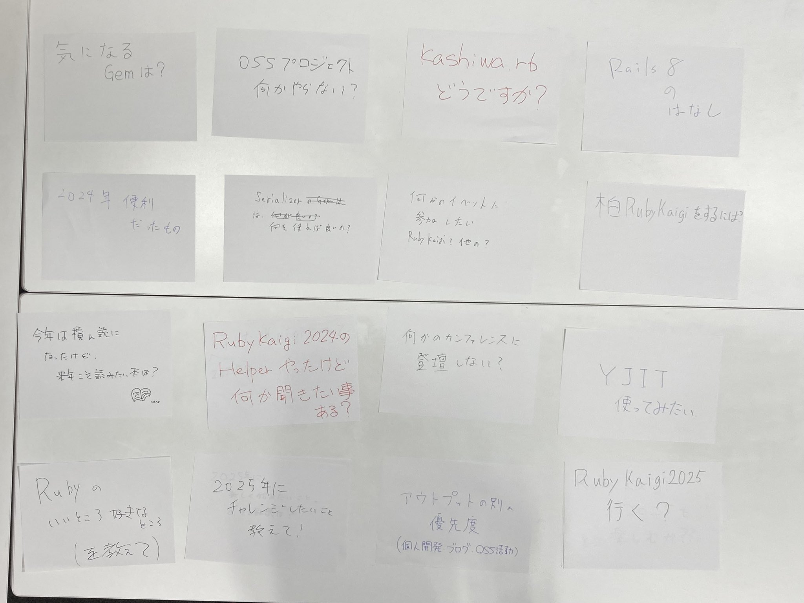

# Kashiwa.rb #6 2024年の出来事をネタにオープンスペーステクノロジー(OST)

## Connpass URL

https://kashiwarb.connpass.com/event/338860/

## タイムテーブル

| 時間 | 内容 | スピーカー |
| --- | --- | --- |
| 18:05 | 開場 | - |
| 18:05〜	| 雑談＆もくもくタイム | - |
| 19:00〜	| アイスブレイク・自己紹介 | みんな |
| 19:05〜 | Ruby界隈の2024年出来事をふりかえる | kozy4324 |
| 19:20〜 | 仮) AIを活用したプログラミングの話 | insyo |
| 19:35〜 | 休憩 | - |
| 19:45〜 | OST進め方確認＆テーマ出し | みんな |
| 20:00〜 | OST | みんな |
| 21:00 | 完全撤収 | - |
| 21:00〜	| 希望者で懇親会 | - |

## 当日の様子

## 発表資料

- https://kashiwarb.connpass.com/event/338860/presentation/

## Toggeter

- https://togetter.com/li/2481910

## 参加レポート記事

- https://kozy4324.hatenablog.jp/entry/2024/12/18/183200

## 会計

| 項目 | 収入 | 支出 |
| --- | --- | --- |
| 参加費 | 900 (100 × 9) | - |
| 会議室代 | - | 770 |
| プロジェクター代 | - | 550 |
| 合計 | 900 | 1320 |
| 収支 | - | 420 |

## 懇親会

HUBでおいしいビールを頂きました（8名参加）
https://www.pub-hub.com/index.php/shop/detail/28
