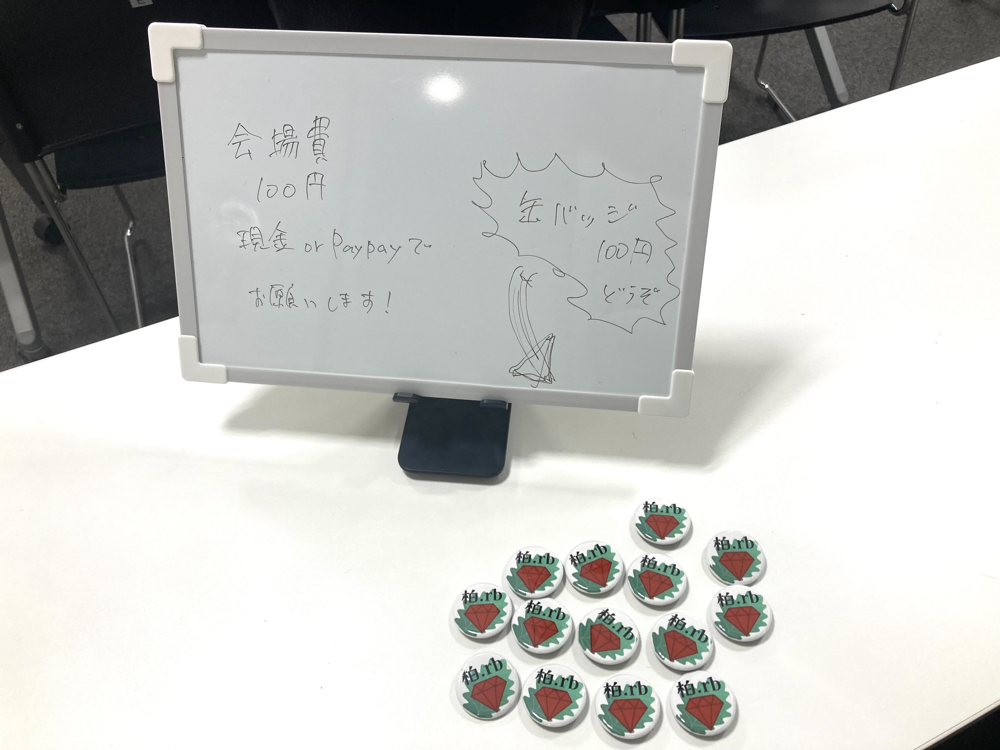

# Kashiwa.rb #7 Ruby 3.4のリリースノート眺める & ソースコードリーディング

## Connpass URL

https://kashiwarb.connpass.com/event/341840/

## タイムテーブル

| 時間 | 内容 | スピーカー |
| --- | --- | --- |
| 18:05 | 開場 | - |
| 18:05〜	| 雑談＆もくもくタイム | - |
| 19:00〜	| アイスブレイク・自己紹介 | みんな |
| 19:05〜 | Ruby 3.4のリリースノート眺める & ソースコードリーディング | みんな |
| 21:00 | 完全撤収 | - |
| 21:00〜	| 希望者で懇親会 | - |

## 当日の様子

## 発表資料

- https://kashiwarb.connpass.com/event/341840/presentation/

## Toggeter

- https://togetter.com/li/2499698

## 参加レポート記事

- https://hogarakaryo.hatenablog.com/entry/2025/01/22/221852

## 会計

| 項目 | 収入 | 支出 |
| --- | --- | --- |
| 参加費 | 900 (100 × 9) | - |
| 会議室代 | - | 1100 |
| プロジェクター代 | - | 550 |
| 合計 | 900 | 1650 |
| 収支 | - | 750 |

## 懇親会

龍晶餃子でおいしいビールと中華を頂きました（6名参加）
https://tabelog.com/chiba/A1203/A120301/12044920/
