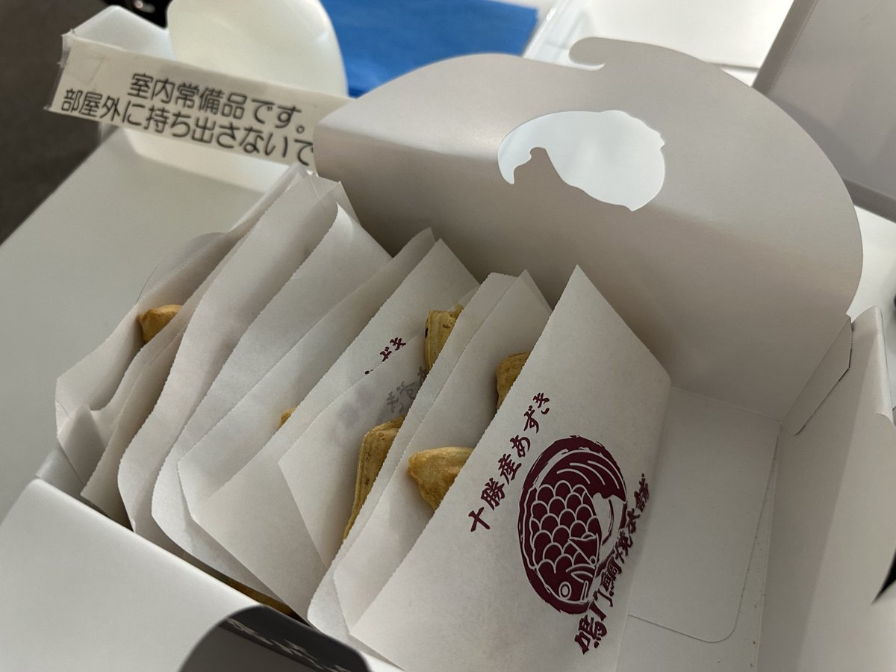
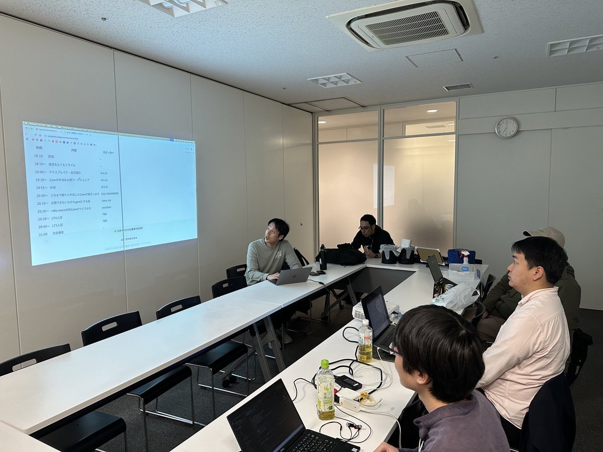
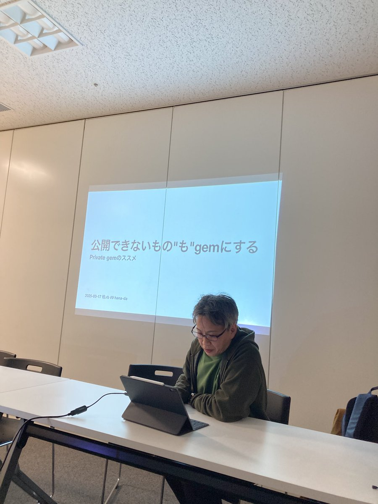

# Kashiwa.rb #9 Gemを作る、Gemを学ぶ

## Connpass URL

https://kashiwarb.connpass.com/event/347810/

## タイムテーブル

| 時間 | 内容 | スピーカー |
| --- | --- | --- |
| 18:10 | 開場 | - |
| 18:10〜	| 雑談＆もくもくタイム | - |
| 19:00〜	| アイスブレイク・自己紹介 | みんな |
| 19:10〜 | Gemの作成＆公開ワークショップ | みんな |
| 19:55〜 | 休憩 | みんな |
| 20:00〜 | ruby.wasm対応Gemのつくりかた| youchan |
| 20:20〜 | 公開できないものもgemにする話 | hana-da |
| 20:40〜 | これまで細々と作成したGemの紹介します | Koji NAKAMURA |
| 21:00   | 完全撤収 | - |

## 当日の様子

## 発表資料

- https://kashiwarb.connpass.com/event/347810/presentation/

## Posfie

- https://posfie.com/@kozy4324/p/KciEasB

## 会計

| 項目 | 収入 | 支出 |
| --- | --- | --- |
| 参加費 | 700 (100 × 7) | - |
| 会議室代 | - | 770 |
| プロジェクター代 | - | 550 |
| 合計 | 700 | 1320 |
| 収支 | - | 620 |
