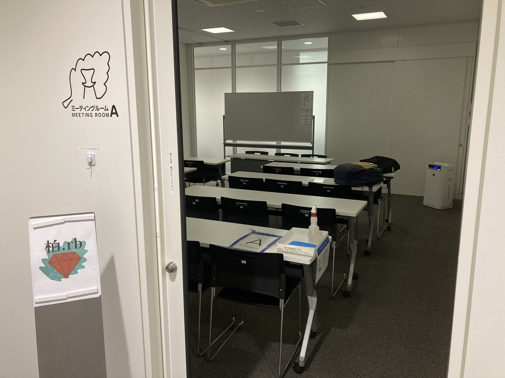
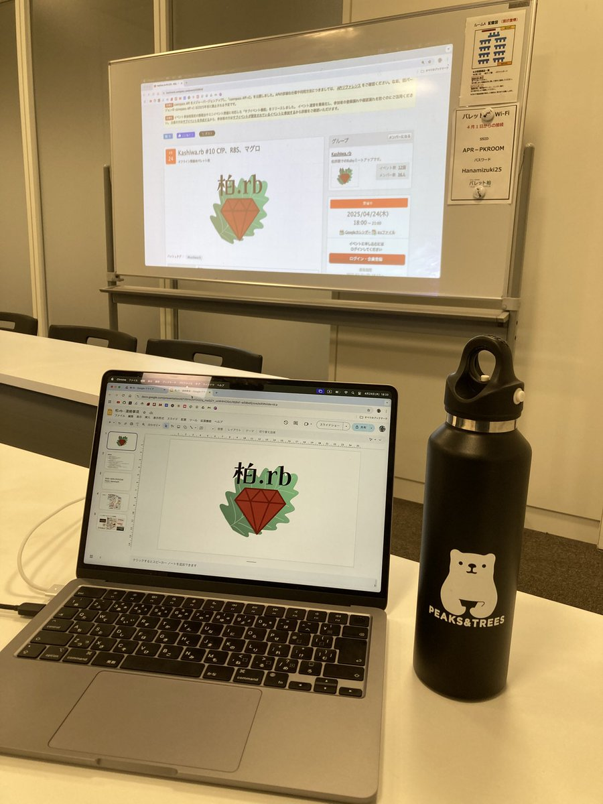
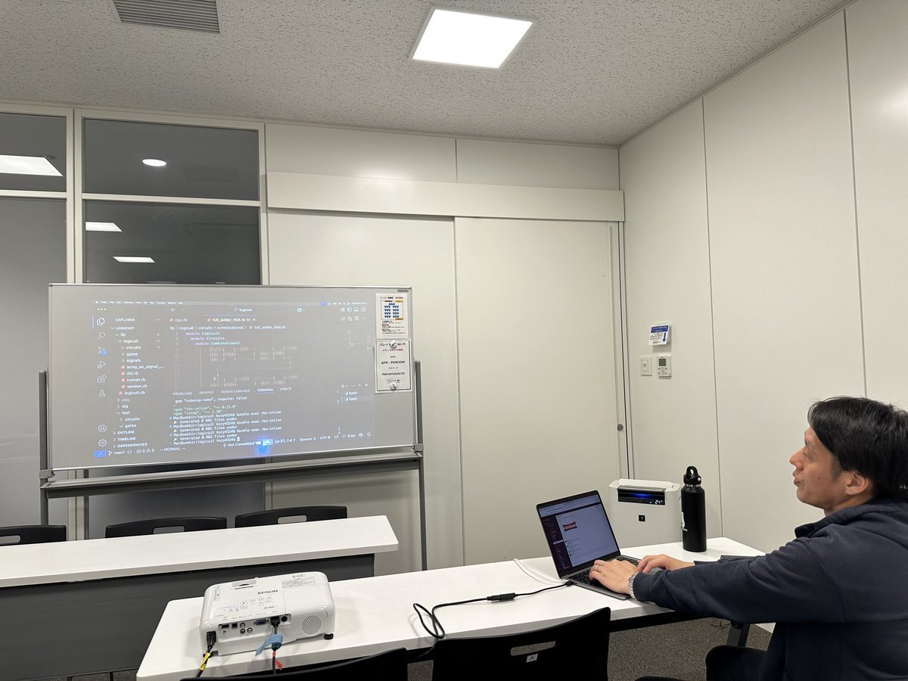
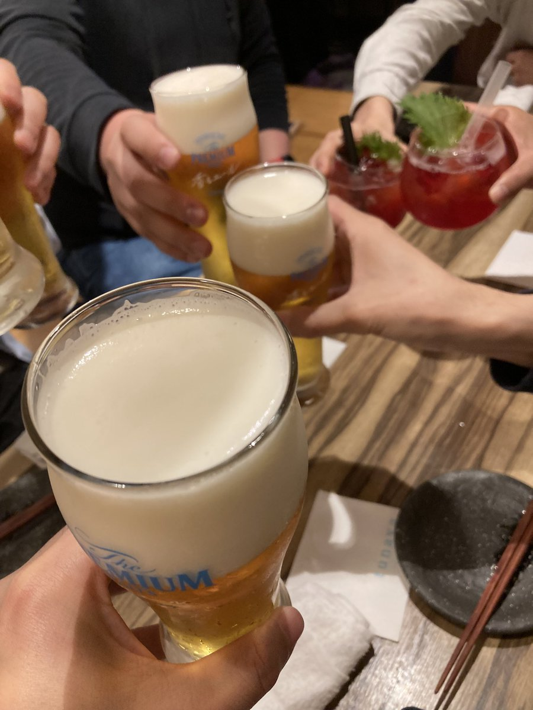
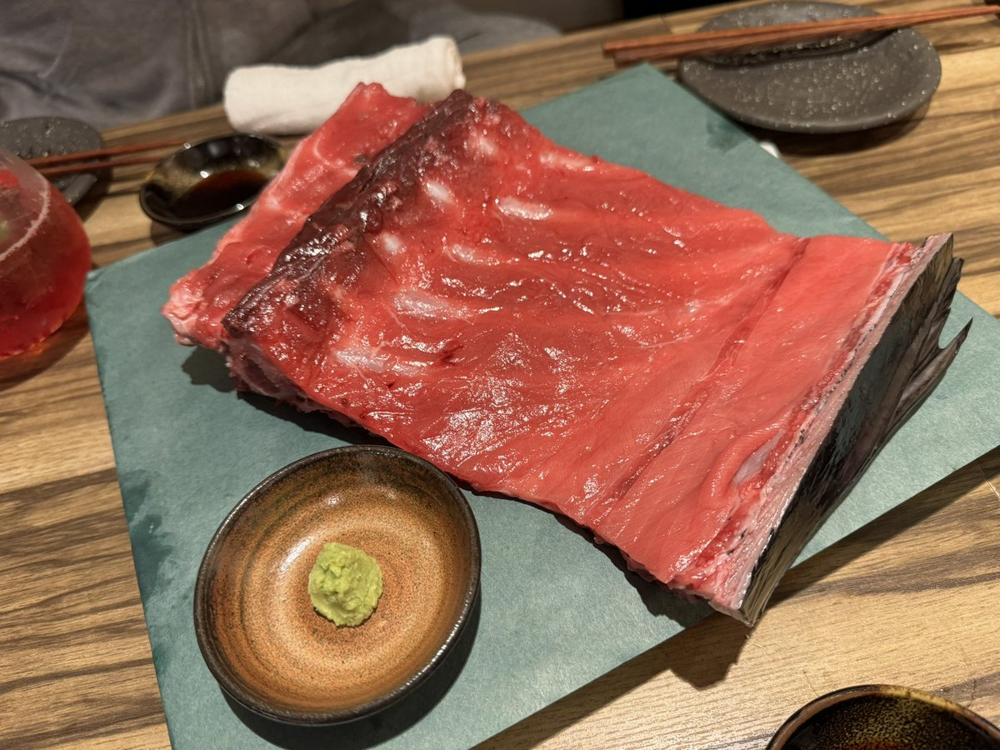

# Kashiwa.rb #10 CfP、RBS、マグロ

## Connpass URL

https://kashiwarb.connpass.com/event/350804/

## タイムテーブル

| 時間 | 内容 | スピーカー |
| --- | --- | --- |
| 18:10 | 開場 | - |
| 18:10〜	| 雑談＆もくもくタイム | - |
| 19:00〜	| アイスブレイク・自己紹介 | みんな |
| 19:10〜 | 関西 Ruby 会議 08 のプロポーザルを書こう | TONY + 希望者 + みんな |
| 19:55〜 | 休憩 | みんな |
| 20:00〜 | RBS に入門する | Koji NAKAMURA + みんな |
| 20:45 | 完全撤収 | - |
| 21:00〜23:00	| 希望者で懇親会 | - |

## 当日の様子

## Posfie

- https://posfie.com/@kozy4324/p/2bAMJP0

## 会計

| 項目 | 収入 | 支出 |
| --- | --- | --- |
| 参加費 | 700 (100 × 7) | - |
| 会議室代 | - | 660 |
| プロジェクター代 | - | 550 |
| 合計 | 700 | 1210 |
| 収支 | - | 510 |

## 懇親会

tunayaでおいしいビールとマグロを頂きました（7名参加）
https://www.imaru-kashiwa.net/
