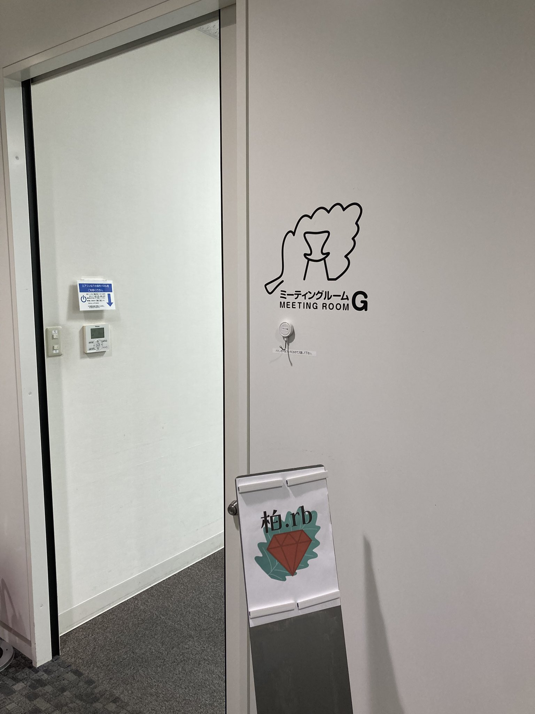
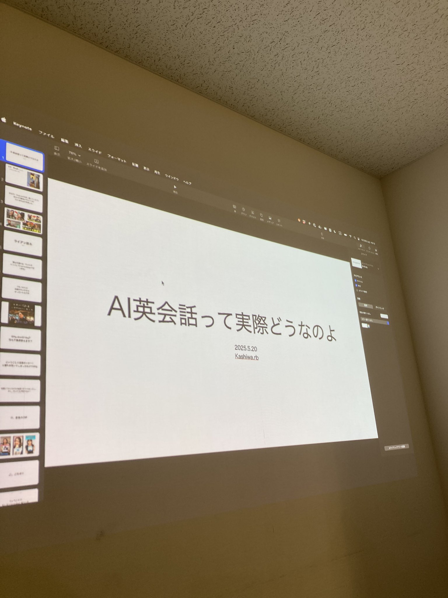
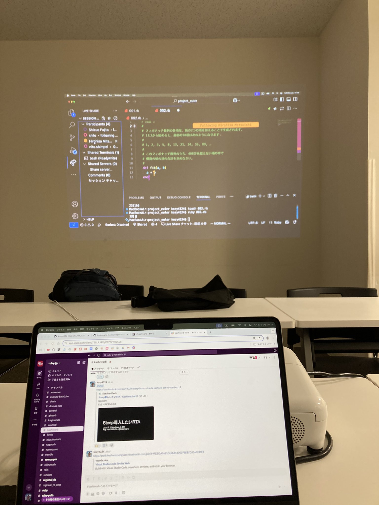
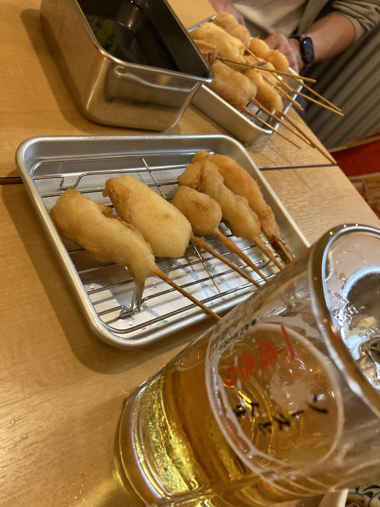

# Kashiwa.rb #11 LT会 & Extreme Fish Bowl

## Connpass URL

https://kashiwarb.connpass.com/event/354820/

## タイムテーブル

| 時間 | 内容 | スピーカー |
| --- | --- | --- |
| 18:10 | 開場 | - |
| 18:10〜 | 雑談＆もくもくタイム | - |
| 19:00〜 | アイスブレイク・自己紹介 | みんな |
| 19:10〜 | LT 1 - AI英会話って実際どうなのよ | shilo |
| 19:20〜 | LT 2 - Steep導入したいRTA | Koji NAKAMURA |
| 19:55〜 | 休憩 | みんな |
| 20:00〜 | Extreme Fish Bowl | みんな |
| 20:45 | 完全撤収 | - |
| 21:00〜23:00	| 希望者で懇親会 | - |

## Extreme Fish Bowl 成果物

- https://github.com/kashiwarb-meetup/2025-05-20_extreme_fish_bowl

## 当日の様子

## Posfie

- https://posfie.com/@kozy4324/p/O8pijm7

## 会計

| 項目 | 収入 | 支出 |
| --- | --- | --- |
| 参加費 | 600 (100 × 6) | - |
| 会議室代 | - | 770 |
| プロジェクター代 | - | 550 |
| 合計 | 600 | 1320 |
| 収支 | - | 720 |

## 懇親会

さじろうでおいしいビールと串揚げを頂きました（4名参加）
https://tabelog.com/chiba/A1203/A120301/12034093/
