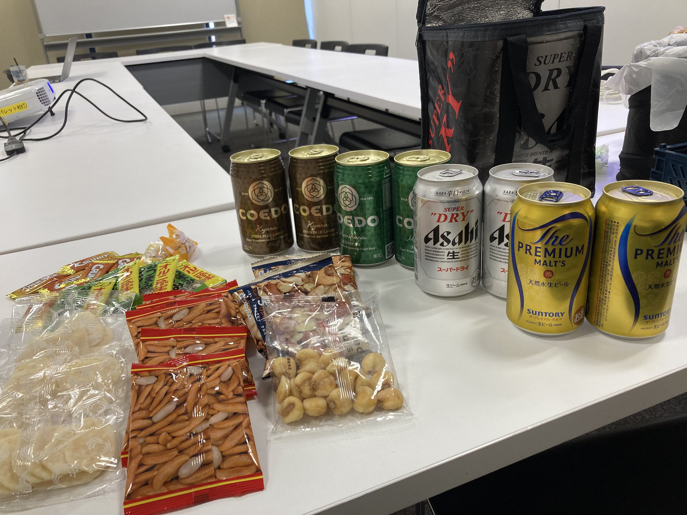
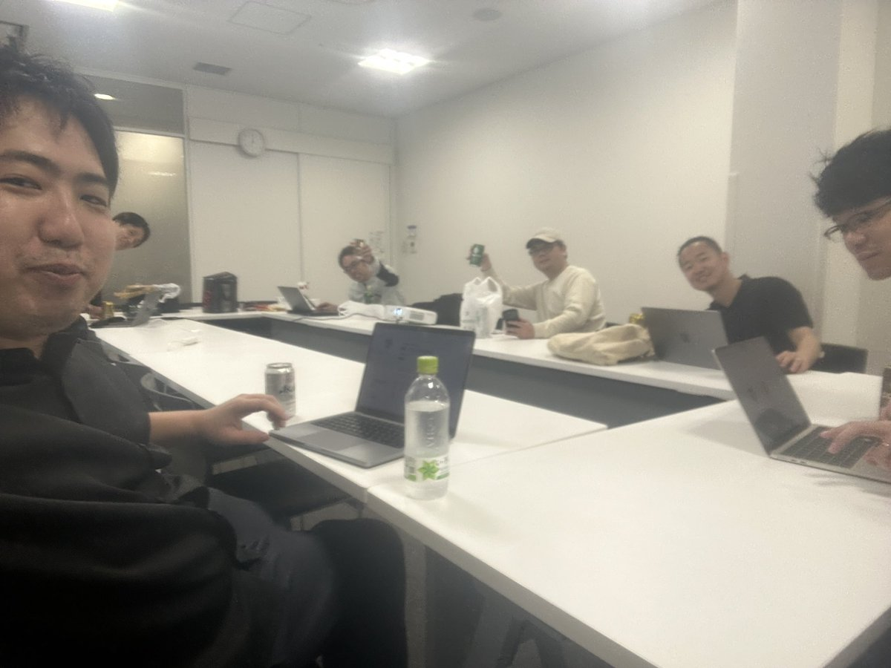
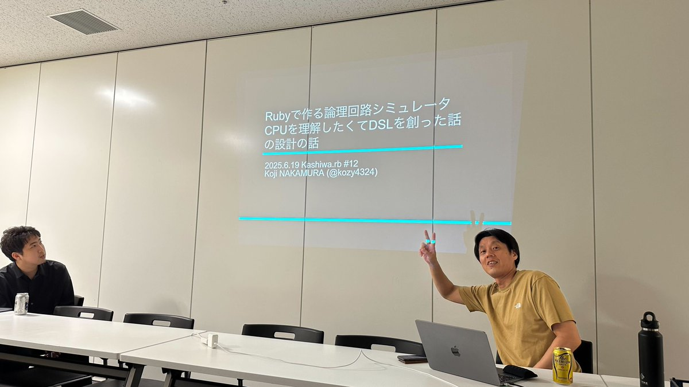

# Kashiwa.rb #12 生活発表会 & 1年ふりかえり会

## Connpass URL

https://kashiwarb.connpass.com/event/357547/

## タイムテーブル

| 時間 | 内容 | スピーカー |
| --- | --- | --- |
| 18:10 | 開場 | - |
| 18:10〜	| 雑談＆もくもくタイム | - |
| 19:00〜	| アイスブレイク・自己紹介 | みんな |
| 19:05〜 | 発表枠1 (20分) | Koji NAKAMURA - 関西Ruby会議08でリジェクトされたプロポーザルの発表をします |
| 19:25〜 | 発表枠2 (10分) | tonyfactory210 - WIP |
| 19:35〜 | 発表枠3 (10分) | katakyo - kaigi on rails2025のプロポーザルの壁打ちしたいです |
| 19:50〜 | 休憩 | - |
| 20:00〜 | 1年ふりかえり会 | みんな |
| 20:45 | 撤収 | - |
| 21:00〜 | 希望者で懇親会 | - |

## 生活発表会

- https://kashiwarb.connpass.com/event/357547/presentation/

## 1年ふりかえり会

- https://ruby-jp.slack.com/archives/C077VTH0K0E/p1750332222419439

## 当日の様子

## Posfie

- https://posfie.com/@kozy4324/p/DkI4Qew

## 参加レポート記事

- https://hisakit.hatenablog.com/entry/2025/06/20/082109

## 会計

| 項目 | 収入 | 支出 |
| --- | --- | --- |
| 参加費 | 700 (100 × 7) | - |
| 会議室代 | - | 770 |
| プロジェクター代 | - | 550 |
| 合計 | 700 | 1320 |
| 収支 | - | 620 |

## 懇親会

わらいいちでおいしいビールとカツオのたたきを頂きました（6名参加）
https://www.hotpepper.jp/strJ004049986/
