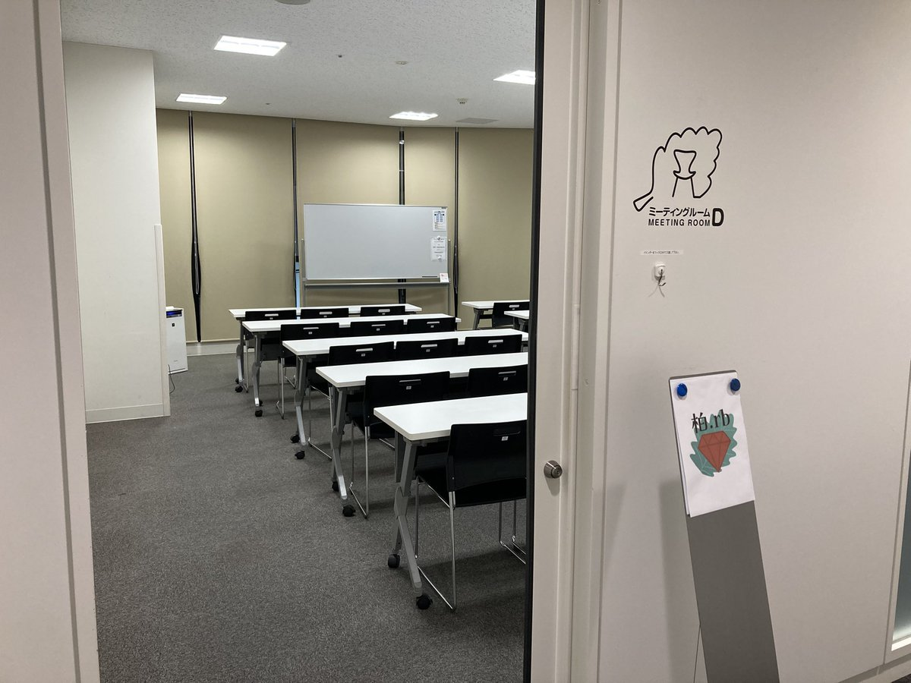
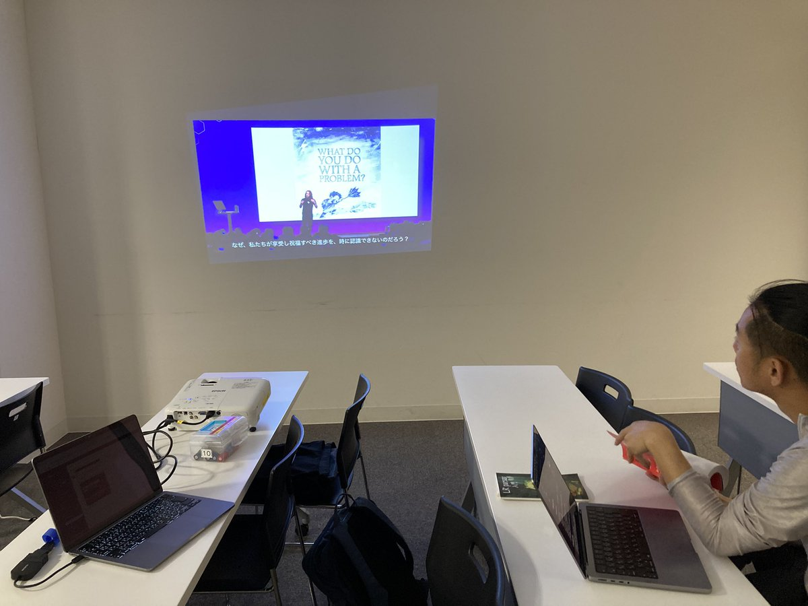
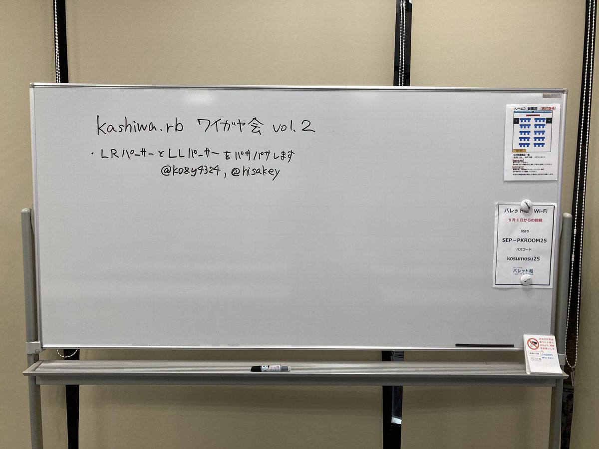
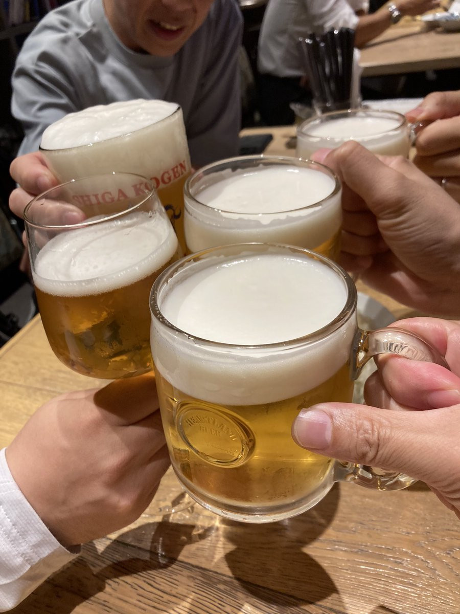

# Kashiwa.rb #15 ワイガヤグループワーク会

## Connpass URL

https://kashiwarb.connpass.com/event/367824/

## タイムテーブル

| 時間 | 内容 | スピーカー |
| --- | --- | --- |
| 18:10 | 開場 | - |
| 18:10〜	| 雑談＆もくもくタイム | - |
| 19:00〜	| アイスブレイク・自己紹介・グループ分け | みんな |
| 19:15〜 | グループワーク | 各グループ |
| 20:30〜 | 成果発表タイム | 各グループ |
| 20:40〜 | 次回開催を決める | みんな |
| 20:45 | 撤収 | - |
| 21:00〜 | 希望者で懇親会 | - |

## ワイガヤグループワークで各自が取り組んだこと

- LRパーサーとLLパーサーについて学ぶ
- Arch Linux系の manjaro linux で Ruby 3.4.6 のビルドに失敗したので調査
- RubyLLM と戯れる
- RFC 9460 Service Binding and Parameter Specification via the DNS (SVCB and HTTPS Resource Records) について調べる

## 当日の様子

## Posfie

- https://posfie.com/@kozy4324/p/eDP7IMF

## 参加レポート記事

- https://hisakit.hatenablog.com/entry/2025/09/20/204356

## 会計

| 項目 | 収入 | 支出 |
| --- | --- | --- |
| 参加費 | 500 (100 × 5) | - |
| 会議室代 | - | 990 |
| プロジェクター代 | - | 550 |
| 合計 | 500 | 1540 |
| 収支 | - | 1040 |

## 懇親会

「THE LIFE」でおいしいビールとソーセージを頂きました（5名参加）
https://the-life.gorp.jp/
