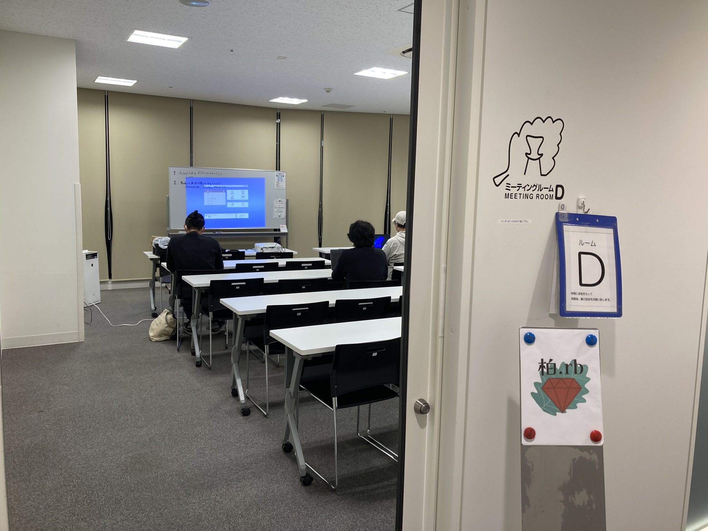
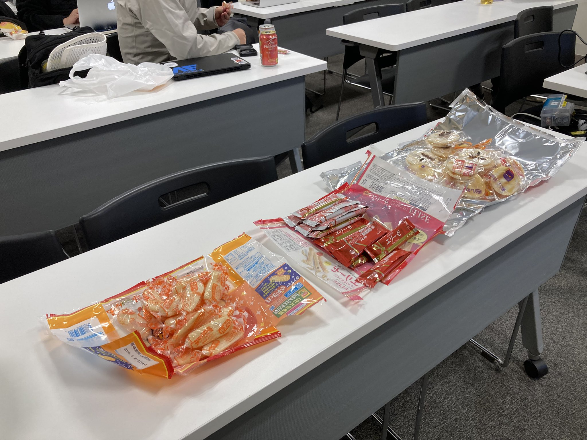
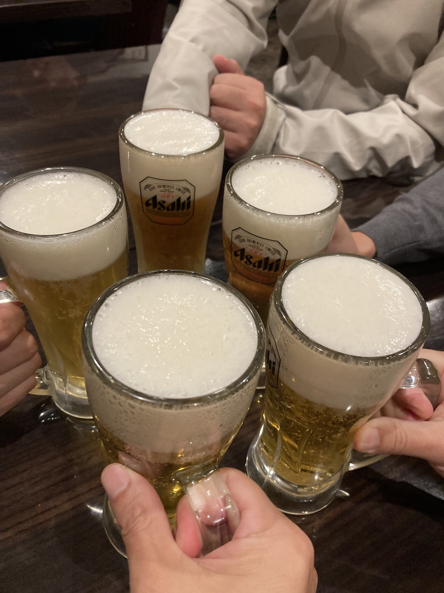

# Kashiwa.rb #16 ワイガヤグループワーク会

## Connpass URL

https://kashiwarb.connpass.com/event/371222/

## タイムテーブル

| 時間 | 内容 | スピーカー |
| --- | --- | --- |
| 18:10 | 開場 | - |
| 18:10〜	| 雑談＆もくもくタイム | - |
| 19:00〜	| アイスブレイク・自己紹介・グループ分け | みんな |
| 19:15〜 | グループワーク | 各グループ |
| 20:30〜 | 成果発表タイム | 各グループ |
| 20:40〜 | 次回開催を決める | みんな |
| 20:45 | 撤収 | - |
| 21:00〜 | 希望者で懇親会 | - |

## ワイガヤグループワークで各自が取り組んだこと＆成果物

- RubyLLMでAIエージェントをつくろう
- Rubyで再帰下降パーサをつくろう
  - https://gist.github.com/kozy4324/5681a4a2b2add9a65670ca63b36ab8b5
- Rails tutorial v8.1やるぞ！
- doorkeeper触ってみる
- TokkuRuby会議のプロポーザルとレシピを考える会
  - https://x.com/tonyfactory210/status/1981316315689427428
- Rails8.1新機能さわる
  - https://x.com/katakyo_51/status/1981369084232290556
- Ractorの新APIためす
  - https://github.com/ranguba/rroonga/pull/231
- RubyでGUIツールキットさわる
- Ractorあまり触ったことない人間がRactor::Portを触ってみる

## 当日の様子

## Posfie

- https://posfie.com/@kozy4324/p/dECdUPE

## 参加レポート記事

- TBA

## 会計

| 項目 | 収入 | 支出 |
| --- | --- | --- |
| 参加費 | 1200 (100 × 12) | - |
| 会議室代 | - | 990 |
| プロジェクター代 | - | 550 |
| 合計 | 1200 | 1540 |
| 収支 | - | 340 |

## 懇親会

龍晶餃子でおいしいビールと中華を頂きました（11名参加）
https://tabelog.com/chiba/A1203/A120301/12044920/
