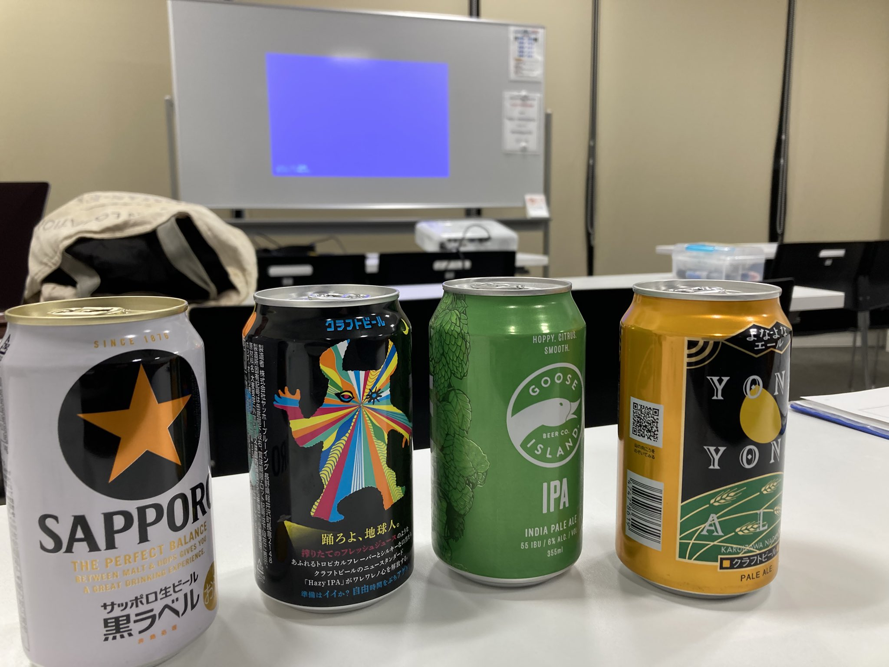
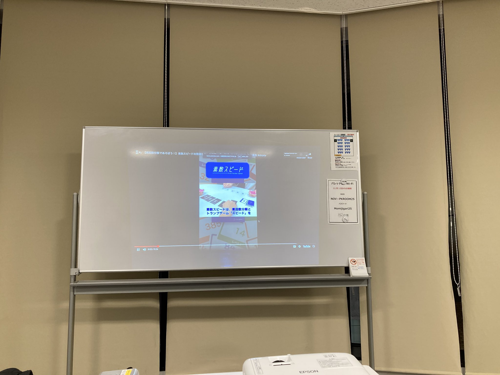
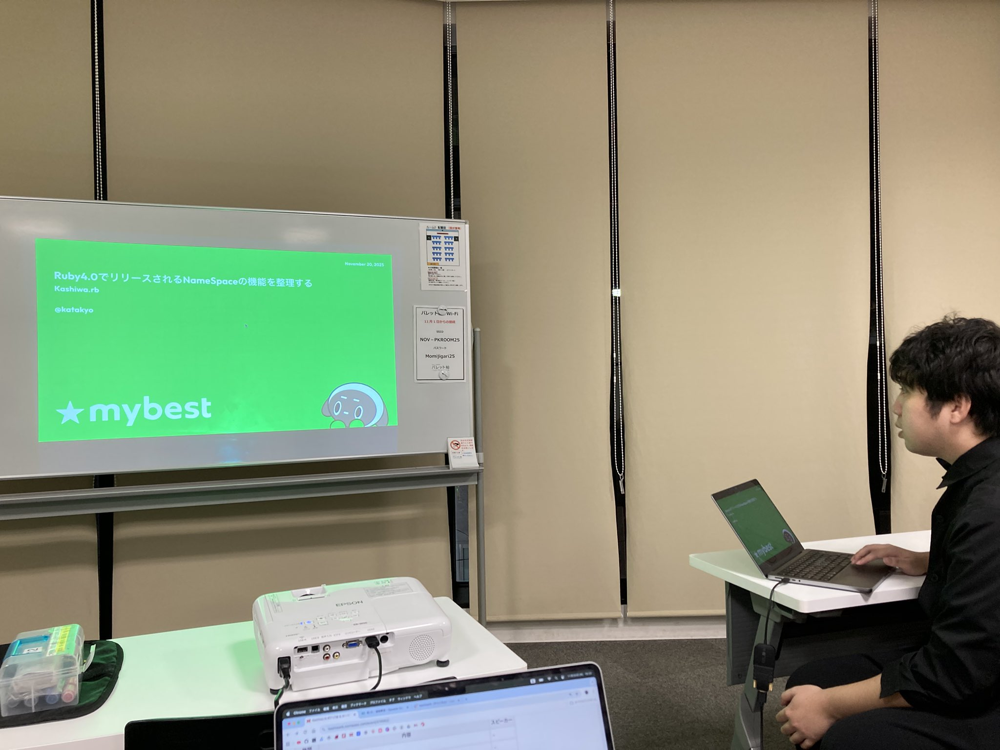
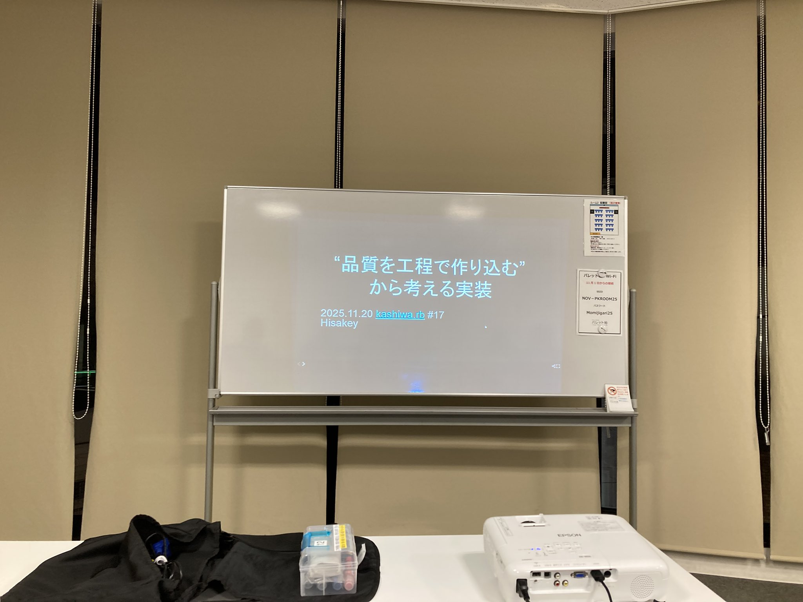
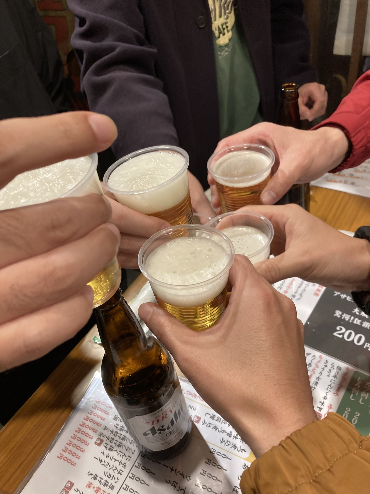
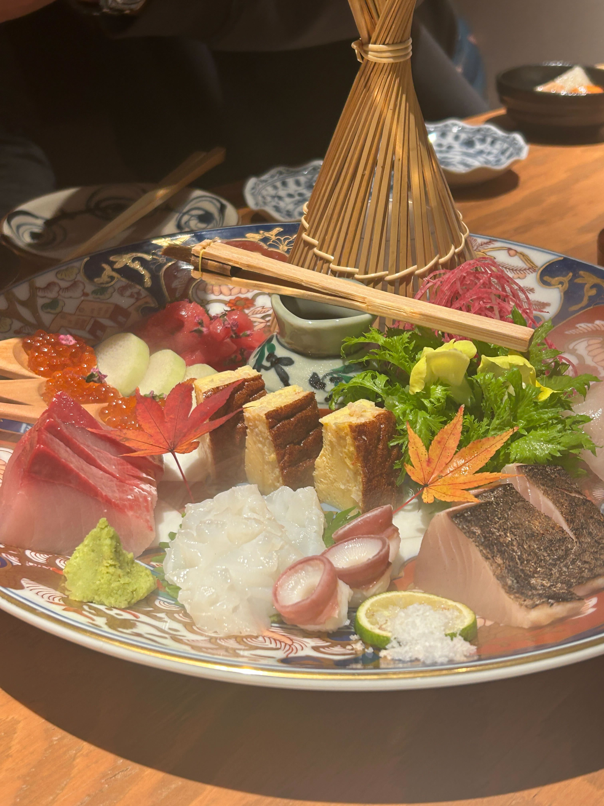

# Kashiwa.rb #17 ワイガヤグループワーク会

## Connpass URL

https://kashiwarb.connpass.com/event/374562/

## タイムテーブル

| 時間 | 内容 | スピーカー |
| --- | --- | --- |
| 18:10 | 開場 | - |
| 18:10〜	| 雑談＆もくもくタイム | - |
| 19:00〜	| アイスブレイク・自己紹介 | みんな |
| 19:10〜 | LT枠1 - 小5息子に素数スピードでボコボコにされたので、練習gemを作った話| TONY |
| 19:25〜 | LT枠2 - Ruby4.0でリリースされるNameSpaceの機能を整理する | katakyo |
| 19:40〜 | LT枠3 - “品質を工程で作り込む” から考える実装 | hisakey |
| 19:55〜 | 休憩 | - |
| 20:00〜 | OST | みんな |
| 20:45 | 撤収 | - |
| 21:00〜 | 希望者で懇親会 | - |

## LT発表資料

https://kashiwarb.connpass.com/event/374562/presentation/

## 当日の様子

## Posfie

- https://posfie.com/@kozy4324/p/4AMEwZk

## 参加レポート記事

- https://hisakit.hatenablog.com/entry/2025/11/22/050423

## 会計

| 項目 | 収入 | 支出 |
| --- | --- | --- |
| 参加費 | 600 (100 × 6) | - |
| 会議室代 | - | 990 |
| プロジェクター代 | - | 550 |
| 合計 | 600 | 1540 |
| 収支 | - | 940 |

## 懇親会

金沢炉端 魚界人でおいしいビールと金沢おでん＆刺身を頂きました（6名参加）
https://tabelog.com/chiba/A1203/A120301/12048243/
