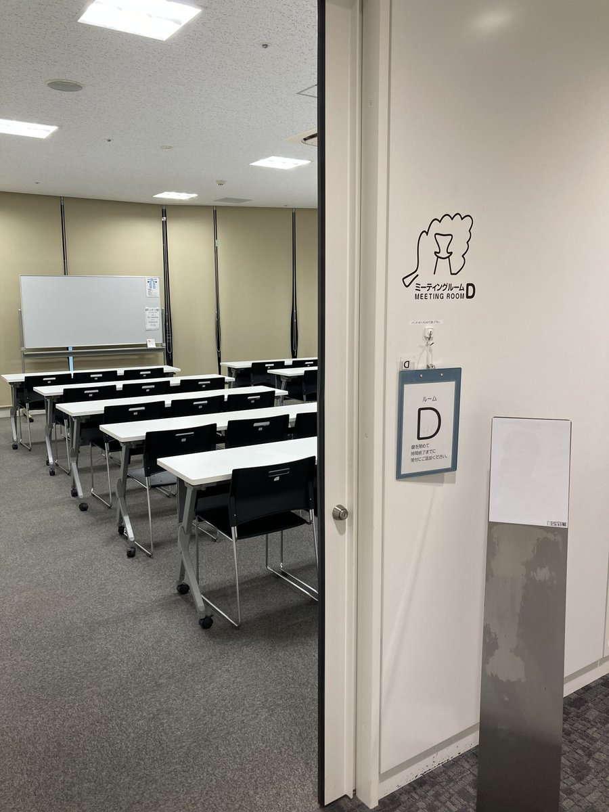
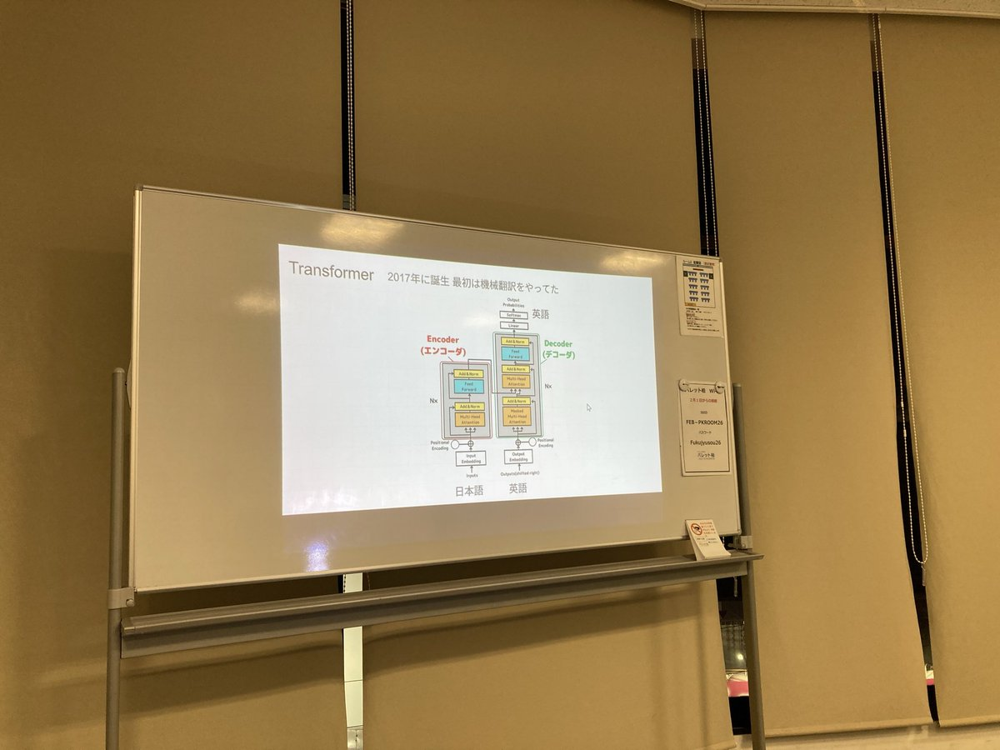
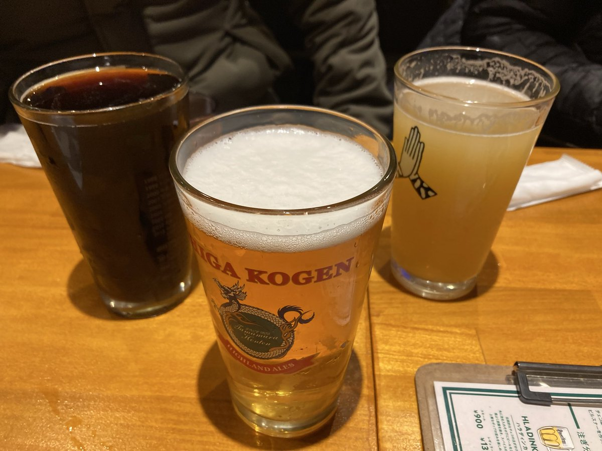

# Kashiwa.rb #20 LT会 & モブAgentic Coding

## Connpass URL

https://kashiwarb.connpass.com/event/384214/

## タイムテーブル

| 時間 | 内容 | スピーカー |
| --- | --- | --- |
| 18:10 | 開場 | - |
| 18:10〜	| 雑談＆もくもくタイム | - |
| 19:00〜	| アイスブレイク・自己紹介 | みんな |
| 19:10〜 | LT枠1 - 最近作ったgemで利用したコアAPIの紹介と深掘り | kozy4324 |
| 19:25〜 | LT枠2 - AIは実装を速くする。でも、理解は速くならない | Hisakey |
| 19:40〜 | LT枠3 - LLMの基礎を雑に学ぶ | bongole |
| 19:55〜 | 休憩 | - |
| 20:00〜 | モブAgentic Coding | みんな |
| 20:45 | 撤収 | - |
| 21:00〜 | 希望者で懇親会 | - |

## LT発表資料

https://kashiwarb.connpass.com/event/384214/presentation/

## 当日の様子

## Posfie

- https://posfie.com/@kozy4324/p/clZc3vr

## 参加レポート記事

- TBA

## 懇親会

柏Clusterでおいしいビールを頂きました（4名参加）
https://cluster-kashiwa.com/
